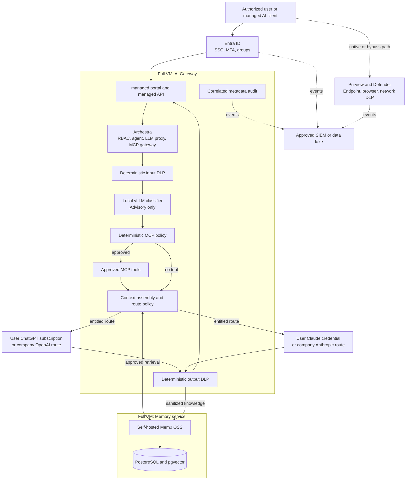

# Architecture decision: governed per-user AI accounts

## Status

Generic target design. Deployment-specific acceptance is required; the included reference implementation does not implement every stage. See [implementation status](implementation-status.md).

## Business requirement

An organization needs visibility and policy control over company use of ChatGPT, Claude,
MCP tools, organizational knowledge, and supported AI clients. Users may have a
ChatGPT account, Claude account, or both. Their own account remains the billing
and provider identity, while the organization owns the route and security policy.

## Decision

Use a hybrid governance stack:

1. **Microsoft Entra ID** owns user identity, MFA, groups, provisioning, and
   deprovisioning.
2. **Archestra** is the mandatory portal, LLM proxy, model router, agent, MCP,
   cost-control, and managed-client plane.
3. **gateway policy/DLP** performs deterministic input and output controls and
   retains body-free decision audit where required.
4. **A local vLLM classifier** proposes risk, intent, memory need, and candidate
   MCP category. Deterministic policy remains authoritative.
5. **Self-hosted Mem0 OSS** stores sanitized, shared organizational knowledge
   with contributor and source provenance.
6. **Provider-native enterprise administration** supplies provider workspace
   controls, retention, native audit, and compliance surfaces.
7. **Microsoft Purview and Defender controls** govern native web, desktop,
   mobile, unmanaged-client, and other bypass paths from managed endpoints and
   networks.
8. **The approved SIEM/data lake** correlates Entra, Purview, provider,
   Archestra, DLP, MCP, Mem0, and infrastructure events.

## Logical architecture

## Product boundary

Archestra controls only traffic that reaches its managed routes. It cannot by
itself inspect an independent provider web/mobile session or a client whose base
URL was changed to a direct provider endpoint. The organization therefore combines the
closed Archestra lane with provider enterprise controls and Purview/Defender.

If the organization cannot enforce the native-account and endpoint layers, the
safer policy is to block direct provider access for company data and require the
managed portal/API.

## Provider model

- ChatGPT subscription credentials are personal-only. Each user completes their
  own device authorization; the credential is never shared with another user.
- Claude passthrough credentials are personal-only and remain bound to the user.
- Company API/provider routes remain available as deterministic fallback and
  service-account paths.
- Route policy uses Entra group entitlement and a user preference when both
  providers are permitted. A client-supplied header cannot grant entitlement.
- An unavailable or revoked provider fails closed; the gateway never borrows
  another person's credential.

## Consequences

- Normal users must receive a purpose-built least-privilege role rather than a
  broadly capable default platform role.
- The exact Archestra release, licensing, subscription flows, DLP interception,
  revocation, and audit behavior require side-by-side acceptance before work
  deployment.
- Self-hosted Mem0 is shared organizational memory for managed requests, not a
  replacement for provider-native conversation retention or Compliance APIs.
- Full GPU passthrough later prevents ordinary live migration of the
  gateway VM and requires a cold-migration/degraded-mode runbook.
