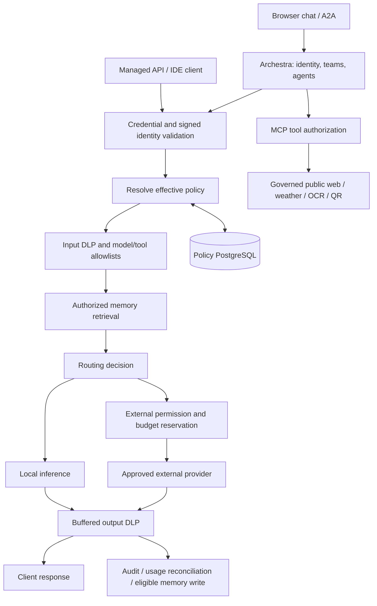

# Request lifecycle and control boundaries

1. Archestra authenticates portal users and supplies signed team identity through the managed provider. API clients use individually issued credentials with server-side hashes and identity bindings.
2. The policy service validates identity and resolves profiles/assignments. Ordinary client headers cannot select another team's policy.
3. Input scanning and configured limits apply before inference. Models, tools, external permission, and memory settings come from effective policy.
4. Middleware handles authorized recall. Shared memory and additional trusted scopes are explicit configuration choices. Retrieved content is context, not authorization or instructions.
5. Routing selects local inference or an allowed external provider. Paid calls require reviewed prices and a transactional monthly budget reservation.
6. Responses are buffered and scanned before delivery. A blocked paid response still incurs provider usage and remains in spend accounting.
7. Audit stores decision metadata rather than prompt/response bodies. Eligible user-authored knowledge can be retained after policy checks; generated answers are not automatically organizational facts.

## Enforcement boundaries

Archestra owns authentication, roles, team/agent visibility, provider bindings, and MCP authorization. The policy service owns DLP, effective profiles, managed-client identity, routing, external budgets, and memory middleware. PostgreSQL stores profiles, assignments, hashed client credentials, and audit metadata.

The Compose integration uses Mem0 Cloud and a local inference routing classifier. It does not deploy a separate self-hosted memory tier or a vLLM guardrail classifier. Direct provider access outside the gateway is outside these controls.

Archestra, policy PostgreSQL, and HTTPS state use separate persistent volumes. Keep data/configuration backups outside Git. Code rollback cannot reconstruct lost database or memory state.
